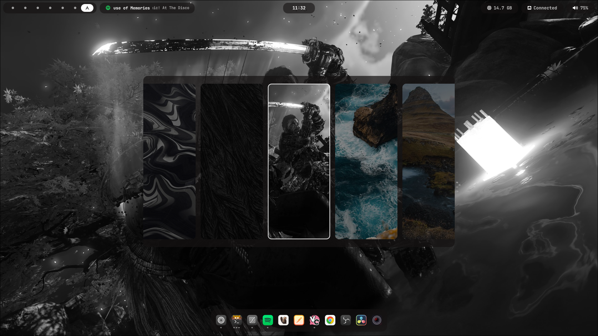

# Yoru

<div align="center">

### A minimal desktop shell for Wayland

Built with [Quickshell](https://quickshell.org/)

[](LICENSE)

</div>

Yoru is a custom desktop shell for [Hyprland](https://hyprland.org/), built entirely in QML using the Quickshell framework. It provides a clean top bar, an application dock, and a music player widget with audio visualization.

## Screenshots

<div align="center">

| Overview | Player widget |
|:---:|:---:|
|  |  |

| Voice dictation | Wallpaper picker |
|:---:|:---:|
|  |  |

</div>

## Repository Structure

```
yoru/
├── shell.qml           # Main entry point
├── controllers/        # IPC-facing controllers (bridge daemon events to state)
│   └── SpeechController.qml
├── modules/            # UI components
│   ├── topbar/         # Top system bar and widgets
│   ├── dock/           # Application dock
│   ├── player/         # Music player widget
│   ├── speech/         # Voice dictation UI (optional, see below)
│   ├── wallpaper/      # Wallpaper picker overlay (optional, see below)
│   └── common/         # Shared utilities and algorithms
└── services/           # Singleton state managers
    ├── Settings.qml       # Persistent shell options (dock pins, future global settings)
    ├── PlayerService.qml   # MPRIS media state + CAVA integration
    ├── AppSearch.qml       # App discovery and icon resolution
    └── TaskbarApps.qml     # Open window tracking
```

## Features

**Top Bar**
System panel with workspace switcher, clock, RAM usage, network status, and volume control. Volume adjusts with the scroll wheel; left-click opens pavucontrol, right-click opens pw-top.

**Application Dock**
Shows pinned and open applications with window count indicator dots for running windows only. Left-click cycles through windows (or launches when not running), middle-click launches a new instance, and right-click toggles pin/unpin. Pinned apps persist across restarts via `~/.config/yoru/settings.json`.

**Music Player**
MPRIS-based player widget for Spotify with album art, scrolling track info, playback controls, a progress bar, and a live audio waveform powered by [CAVA](https://github.com/karlstav/cava). Ships in three variants — `full`, `minimal`, and `compact` — and can be placed in the top bar or the dock, configurable via `~/.config/yoru/settings.json`; see [Configuration](#configuration) below.

**App Search**
Fuzzy application search using FuzzySort with a smart icon resolution fallback chain — handles mismatched app IDs, Steam games, and more.

**Workspace Switching**
Hyprland workspace integration with numbered buttons (1–9) dispatched over IPC.

**Voice Dictation** *(optional)*
Live speech-to-text preview while recording, shown as a floating pill under the top bar, plus a waveform indicator that replaces the clock while active. Fully opt-in — see [Voice Dictation](#voice-dictation-optional) below.

**Wallpaper Picker** *(optional)*
A keyboard-driven overlay for browsing and applying wallpapers, with cached thumbnails generated in the background. Toggled via a keybind instead of always visible. Fully opt-in — see [Wallpaper Picker](#wallpaper-picker-optional) below.

## Installation

> **Arch Linux only** for now.

Clone the repo and run the install script:

```bash
git clone https://github.com/kauavitorrodrigues/yoru
cd yoru
./install.sh
```

The script will:

1. Install `yay` if not present
2. Install all required packages via `pacman` and `yay`
3. Create a persistent virtual **Spotify Sink** in PipeWire — Spotify routes here so CAVA can capture it in isolation, and a loopback forwards the audio back to your real output so you can still hear it
4. Add a WirePlumber rule that automatically routes Spotify to that sink on launch
5. Copy the CAVA config to `~/.config/cava/configs/yoru.conf`
6. Symlink the repo to `~/.config/quickshell/yoru`
7. Create `~/.config/yoru/settings.json` for persistent shell settings (including dock pinned apps)

Then start Yoru:

```bash
quickshell -p ~/.config/quickshell/yoru
```

Or add it to `hyprland.conf` to launch on startup:

```ini
exec-once = quickshell -p ~/.config/quickshell/yoru
```

### Audio visualization note

After the first Spotify launch post-install, WirePlumber should automatically route it to the **Yoru Spotify Sink**. You should hear audio normally and see the waveform in the player widget.

If something doesn't work:

- **No waveform / can't hear Spotify** — open `pavucontrol`, go to the **Playback** tab, and manually set Spotify's output to *Yoru Spotify Sink*. The loopback will then forward it to your real output.
- **Waveform works but no sound** — the loopback may not have linked correctly. Re-run `./install.sh` and restart Spotify.

> WirePlumber 0.5+ is required for the automatic routing rule. Older setups will need the manual `pavucontrol` step.

### Configuration

`~/.config/yoru/settings.json` is organized into three top-level sections:

- **`layout`** — purely structural: which zone (dock / top bar left / center / right) each widget renders in, and in what order. No visual styling lives here.
- **`modules`** — per-widget behavior/config: the player's variant, the voice dictation and wallpaper picker opt-in flags, the workspace count bounds.
- **`appearance`** — every visual token the shell renders with: animation durations/curves, font family/sizes, colors, and per-feature sizing (icon size, radii, padding, etc.). This is a 1:1 override of `Appearance.qml`'s defaults — anything you don't set falls back to the built-in value.

```json
{
    "layout": {
        "dock": {
            "position": "bottom",
            "items": ["apps"],
            "pinnedApps": ["zen", "kitty", "Spotify"]
        },
        "topbar": {
            "left": ["workspaces"],
            "center": ["clock"],
            "right": ["player", "memory", "network", "volume"]
        }
    },
    "modules": {
        "player": {
            "variant": "full"
        },
        "speech": {
            "enabled": false,
            "socketPath": ""
        },
        "wallpaper": {
            "enabled": false,
            "directory": "",
            "cacheDir": ""
        },
        "workspaces": {
            "defaultCount": 5,
            "maxCount": 10
        }
    },
    "appearance": {
        "sizing": {
            "dock": {
                "icons": {
                    "size": 44
                }
            }
        },
        "colors": {
            "textPrimary": "#ffffff"
        }
    }
}
```

There is no in-app settings screen yet — it's plain JSON — but the shape above (structure separated from behavior, ordered arrays for placement) is deliberately meant to double as the data model for an in-app settings UI later. You only need to specify the keys you want to override — `appearance` (like `layout` and `modules`) is deep-merged with the built-in defaults, so a partial block like the one above is enough to bump the dock's icon size without repeating every other token.

#### `layout.topbar` / `layout.dock` — widget placement

- `layout.topbar.left` / `center` / `right` — each is an ordered list of tokens drawn from `"workspaces"`, `"clock"`, `"player"`, `"memory"`, `"network"`, `"volume"`. Move a token between arrays or reorder it within one to change where it renders — e.g. moving `"player"` to the front of `right` puts it before Memory, to the back puts it after Volume.
- `layout.dock.items` — an ordered list of `"apps"` and, optionally, `"player"`. Since the dock is a single row, `"player"` can only go before or after `"apps"` (`["player", "apps"]` for the left edge, `["apps", "player"]` for the right edge) — there's no "middle" option, since splitting the app list in two would make it re-center unevenly as apps come and go.
- `layout.dock.pinnedApps` — app IDs pinned to the dock so they show up even when not running (see [Application Dock](#features) above); persisted automatically when you pin/unpin from the right-click menu.
- `layout.dock.position` — reserved for future use (currently only `"bottom"` is actually implemented; the dock is hardcoded to anchor to the bottom of the screen).
- Leaving any of the three `topbar` arrays or `dock.items` empty (`[]`) renders nothing in that spot — it does not fall back to a default.

#### `modules.player.variant` — player widget layout

Controls the player's density, independent of where it's placed:

```json
"modules": {
    "player": {
        "variant": "compact"
    }
}
```

- `"full"` *(default)* — album art, stacked title/artist, and the waveform.
- `"minimal"` — a Spotify icon in place of the album art, title and artist on a single line, and a shorter waveform to match.
- `"compact"` — same as `"minimal"` but drops the artist entirely, showing only the Spotify icon and the track title. Handy for tight spots like the dock.

#### `modules.workspaces` — workspace switcher bounds

```json
"modules": {
    "workspaces": {
        "defaultCount": 5,
        "maxCount": 10
    }
}
```

- `defaultCount` — minimum number of workspace buttons always shown.
- `maxCount` — hard ceiling; the switcher grows past `defaultCount` as you focus higher workspace numbers, up to this limit.

#### `appearance` — theme tokens

Every constant in `modules/common/Appearance.qml` is overridable here, grouped the same way it's defined there:

```json
"appearance": {
    "animation": {
        "instant": 80, "fast": 120, "normal": 200, "medium": 300, "slow": 800,
        "playerProgress": 900, "marqueePause": 1500
    },
    "animationCurves": {
        "linear": 0, "inOutQuad": 0, "inCubic": 0, "outCubic": 0
    },
    "fonts": {
        "primary": "JetBrainsMono Nerd Font",
        "sizes": { "xs": 8, "sm": 12, "md": 13, "base": 14 }
    },
    "colors": {
        "transparent": "transparent",
        "shellSurface": "#9e141212", "shellSurfaceElevated": "#b8141212",
        "textPrimary": "#ffffff", "textSecondary": "#c4c4c4", "textMuted": "#a0a0a0",
        "textDisabled": "#4cffffff", "textOnLight": "#505050",
        "stateDanger": "#FF8080",
        "hoverSoft": "#1fffffff", "hoverStrong": "#29ffffff",
        "indicatorActive": "#e6ffffff", "indicatorInactive": "#73ffffff",
        "cardPlaceholder": "#14ffffff", "scrim": "#66000000"
    },
    "sizing": {
        "dock": {
            "panelHeight": 72, "bottomMargin": 14, "radius": 18,
            "padding": { "top": 1, "bottom": 4, "left": 14, "right": 14 },
            "previewRadius": 14,
            "icons": {
                "size": 38, "spacing": 12, "hoverPadding": 5, "hoverRadius": 13
            }
        },
        "topbar": {
            "cardRadius": 15, "workspaceButtonFocusedSize": 13, "workspaceButtonIdleSize": 8
        },
        "wallpaper": {
            "overlayWidth": 1000, "overlayHeight": 550, "overlayRadius": 15,
            "itemWidth": 200, "itemHeight": 500, "itemRadius": 12
        }
    }
}
```

- `animation` — durations in milliseconds for hover/press transitions, crossfades, the player's progress bar, and the dock/topbar marquee pause.
- `animationCurves` — [`Easing`](https://doc.qt.io/qt-6/qml-qtquick-propertyanimation.html#easing.type-prop) curve type enum values used by those animations (leave these alone unless you know the specific Qt enum ints you want).
- `fonts` — the shell's font family and the size scale (`xs`/`sm`/`md`/`base`, in px) used across widgets.
- `colors` — every color token the shell draws with, as `"#RRGGBB"` or `"#AARRGGBB"` (alpha-first) hex strings — surfaces, text tones, hover/indicator states, and the danger/scrim colors.
- `sizing` — per-feature layout constants: dock panel height/padding/icon sizing/radii, topbar card radius and workspace dot sizes, and wallpaper overlay/thumbnail dimensions.
- `sizing.dock.padding` — insets the dock's row of items from its background on each side independently (`top`/`bottom`/`left`/`right`); e.g. `{ "left": 30, "right": 2 }` shifts the whole item row toward the right edge instead of centering it. Note this is unrelated to `layout.dock.items` — an unrecognized token there (anything other than `"apps"`/`"player"`) silently renders as a zero-width slot that still eats one `icons.spacing` gap, which looks just like uneven padding on whichever side it lands. If one edge looks off even with equal `padding.left`/`right`, check `layout.dock.items` for a typo before touching this.
- `sizing.dock.icons` — everything about the dock's app icons grouped under one key instead of scattering `icon`-prefixed fields across `sizing.dock`: `size` (icon dimensions), `spacing` (gap between icons), `hoverPadding`/`hoverRadius` (the highlight circle behind an icon on hover — `hoverPadding` is how many pixels it extends past `size` on each side, so the highlight scales sensibly if you change `size` instead of looking too tight or too loose).

Colors and sizes both accept partial overrides — e.g. bumping just `sizing.dock.icons.size` to make dock icons bigger, or `colors.textPrimary` to shift the whole shell's primary text color, without touching anything else.

### Voice Dictation (optional)

Yoru can show a live speech-to-text preview while recording, backed by [yoru-speech](https://github.com/kauavitorrodrigues/yoru-speech), a separate offline dictation daemon. This integration is **disabled by default** and has zero footprint until turned on — no IPC connection, no daemon-facing subprocess, nothing — because both the daemon bridge (`SpeechController`) and the transcript pill (`TranscriptOverlay`) are only ever instantiated behind the flag below. (The waveform indicator itself always exists in the top bar per Yoru's crossfade pattern — Clock and indicator are both mounted so they can fade between each other — but it just sits invisible and idle with no daemon connected.)

To enable it:

1. Install and run `yoru-speech` separately (see its own repo for setup — model selection, language, and everything else specific to transcription lives in *its* config, not Yoru's).
2. Add a `speech` block under `modules` in `~/.config/yoru/settings.json`:

   ```json
   "modules": {
       "speech": {
           "enabled": true,
           "socketPath": ""
       }
   }
   ```

   - `enabled` — turns the whole integration on/off: the IPC connection to `yoru-speech` and the transcript pill only exist while this is `true`.
   - `socketPath` — path to the daemon's IPC socket. Leave empty to auto-detect at `$XDG_RUNTIME_DIR/yoru-speech.sock`; only set this if you've configured `yoru-speech` to use a custom path.

There is no in-app settings screen for this on purpose — it's a small, optional flag for people who happen to run the daemon, not a feature meant to require configuration UI of its own.

### Wallpaper Picker (optional)

Yoru can show a keyboard-driven wallpaper picker overlay, backed by [awww](https://codeberg.org/LGFae/awww) for applying the selection. This integration is **disabled by default** and has zero footprint until turned on — the overlay and its IPC toggle handler are only ever instantiated behind the flag below.

To enable it:

1. Install and run `awww-daemon` separately (already handled by `exec-once = awww-daemon` if you're on this machine's Hyprland config).
2. Add a `wallpaper` block under `modules` in `~/.config/yoru/settings.json`:

   ```json
   "modules": {
       "wallpaper": {
           "enabled": true,
           "directory": "",
           "cacheDir": ""
       }
   }
   ```

   - `enabled` — turns the whole integration on/off: the overlay and the IPC toggle only exist while this is `true`.
   - `directory` — folder to scan for wallpapers. Leave empty to default to `~/Pictures/Wallpapers`.
   - `cacheDir` — folder to store generated thumbnails. Leave empty to default to `$XDG_CACHE_HOME/yoru/wallpaper-thumbnails` (or `~/.cache/yoru/wallpaper-thumbnails`).

3. Bind a key to toggle it in `hyprland.conf`:

   ```ini
   bind = $mainMod, W, exec, qs -p ~/.config/quickshell/yoru ipc call wallpaper toggle
   ```

Navigate with Tab / Shift+Tab / arrow keys, apply with Enter/Return, close with Escape.

## Dependencies

The install script handles all of these automatically on Arch.

| Package | Source | Purpose |
|---------|--------|---------|
| `quickshell-git` | AUR (`yay`) | Shell framework |
| `pipewire` | pacman | Audio backend |
| `wireplumber` | pacman | PipeWire session manager |
| `pipewire-pulse` | pacman | PulseAudio compatibility layer |
| `cava` | pacman | Audio visualizer (waveform) |
| `python` | pacman | Wallpaper scan/thumbnail scripts (optional feature) |
| `python-pillow` | pacman | Wallpaper thumbnail generation (optional feature) |

**Also required (install manually):**
- [Hyprland](https://hyprland.org/) — Wayland compositor
- `pavucontrol` — volume control GUI
- `foot` — terminal (used for pw-top shortcut)
- JetBrainsMono Nerd Font
- [awww](https://codeberg.org/LGFae/awww) — wallpaper daemon (only needed for the optional [Wallpaper Picker](#wallpaper-picker-optional))

## Structure Details

### Modules

| Module | Description |
|--------|-------------|
| `modules/topbar/` | Top bar container and all system widgets |
| `modules/dock/` | Dock with open app list and per-app buttons |
| `modules/player/` | Full player UI — album, info, controls, waveform |
| `modules/speech/` | Voice dictation UI — waveform indicator and live transcript pill (optional, see [Voice Dictation](#voice-dictation-optional)) |
| `modules/wallpaper/` | Wallpaper picker overlay — carousel, thumbnail scripts, and visibility state (optional, see [Wallpaper Picker](#wallpaper-picker-optional)) |
| `modules/common/` | FuzzySort and Levenshtein distance algorithms, date utilities |

### Services

| Service | Description |
|---------|-------------|
| `PlayerService.qml` | Tracks MPRIS state (title, artist, art, play state), runs CAVA subprocess for waveform data at ~60fps |
| `AppSearch.qml` | Fuzzy app search with multi-step icon guessing fallback |
| `Settings.qml` | Centralized persistent shell settings used by services/modules |
| `TaskbarApps.qml` | Maintains a merged map of pinned + open apps grouped by app ID |

### Controllers

| Controller | Description |
|------------|-------------|
| `SpeechController.qml` | Bridges `yoru-speech` IPC events into `SpeechState` (see [Voice Dictation](#voice-dictation-optional)); only instantiated when `modules.speech.enabled` is `true` |
| `WallpaperController.qml` | Exposes a Quickshell `IpcHandler` (`qs ipc call wallpaper toggle`) that flips `WallpaperState.visible` (see [Wallpaper Picker](#wallpaper-picker-optional)); only instantiated when `modules.wallpaper.enabled` is `true` |

## Copying

Feel free to copy, modify, and redistribute anything here. Use whatever you find useful — components, logic, structure, all of it.

The only requirement is to keep the copyright notice when distributing substantial portions of the code. See [LICENSE](LICENSE) for the full MIT terms.

## Credits

- [Quickshell](https://quickshell.org/) — shell framework
- [CAVA](https://github.com/karlstav/cava) — console audio visualizer
- [FuzzySort](https://github.com/farzher/fuzzysort) — fuzzy search algorithm
- [end-4](https://github.com/end-4) — dock base derived from [dots-hyprland](https://github.com/end-4/dots-hyprland)
