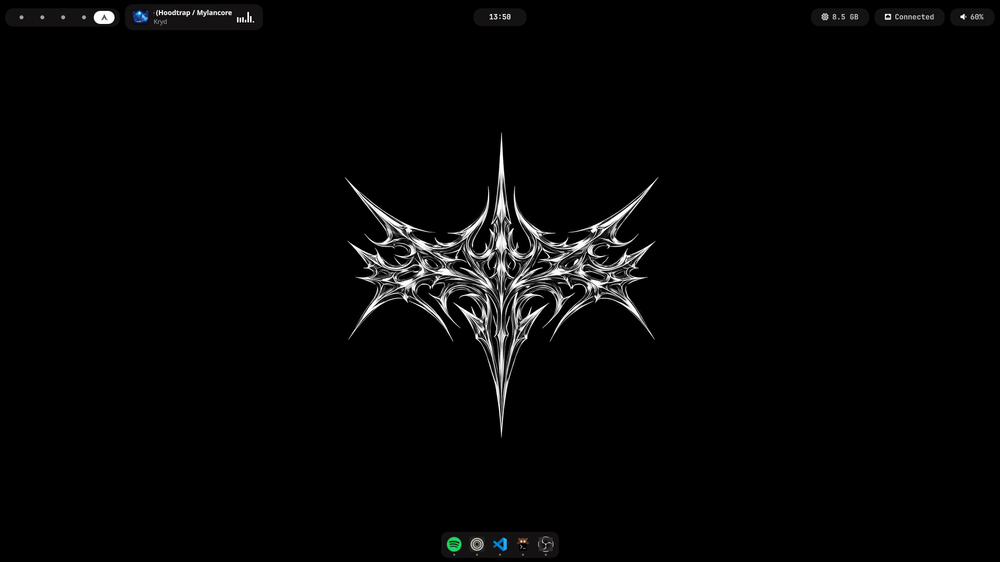
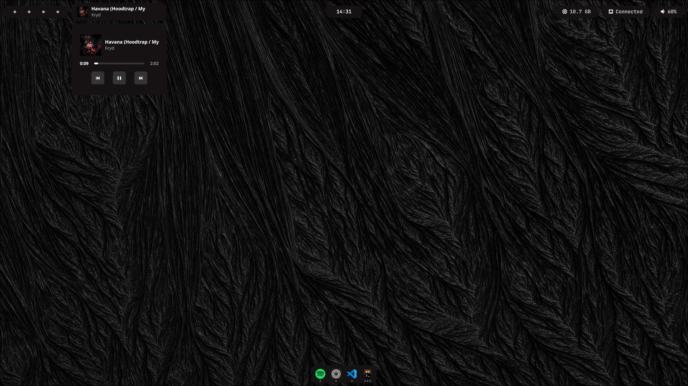
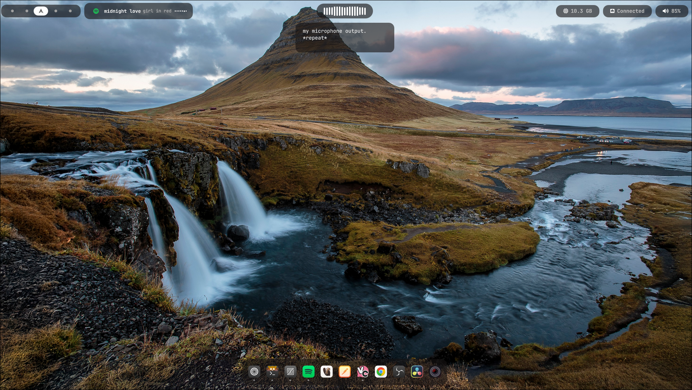

# Yoru

<div align="center">

### A minimal desktop shell for Wayland

Built with [Quickshell](https://quickshell.org/)

[](LICENSE)

</div>

Yoru is a custom desktop shell for [Hyprland](https://hyprland.org/), built entirely in QML using the Quickshell framework. It provides a clean top bar, an application dock, and a music player widget with audio visualization.

## Screenshots

<div align="center">

| Overview | Player widget |
|:---:|:---:|
|  |  |

| Voice dictation |
|:---:|
|  |

</div>

## Repository Structure

```
yoru/
├── shell.qml           # Main entry point
├── controllers/        # IPC-facing controllers (bridge daemon events to state)
│   └── SpeechController.qml
├── modules/            # UI components
│   ├── topbar/         # Top system bar and widgets
│   ├── dock/           # Application dock
│   ├── player/         # Music player widget
│   ├── speech/         # Voice dictation UI (optional, see below)
│   └── common/         # Shared utilities and algorithms
└── services/           # Singleton state managers
    ├── Settings.qml       # Persistent shell options (dock pins, future global settings)
    ├── PlayerService.qml   # MPRIS media state + CAVA integration
    ├── AppSearch.qml       # App discovery and icon resolution
    └── TaskbarApps.qml     # Open window tracking
```

## Features

**Top Bar**
System panel with workspace switcher, clock, RAM usage, network status, and volume control. Volume adjusts with the scroll wheel; left-click opens pavucontrol, right-click opens pw-top.

**Application Dock**
Shows pinned and open applications with window count indicator dots for running windows only. Left-click cycles through windows (or launches when not running), middle-click launches a new instance, and right-click toggles pin/unpin. Pinned apps persist across restarts via `~/.config/yoru/settings.json`.

**Music Player**
MPRIS-based player widget for Spotify with album art, scrolling track info, playback controls, a progress bar, and a live audio waveform powered by [CAVA](https://github.com/karlstav/cava). Ships in two variants — a `full` layout (album art, stacked title/artist) and a `minimal` one (Spotify icon, single-line title + artist) — configurable via `~/.config/yoru/settings.json`; see [Player Widget Variant](#player-widget-variant) below.

**App Search**
Fuzzy application search using FuzzySort with a smart icon resolution fallback chain — handles mismatched app IDs, Steam games, and more.

**Workspace Switching**
Hyprland workspace integration with numbered buttons (1–9) dispatched over IPC.

**Voice Dictation** *(optional)*
Live speech-to-text preview while recording, shown as a floating pill under the top bar, plus a waveform indicator that replaces the clock while active. Fully opt-in — see [Voice Dictation](#voice-dictation-optional) below.

## Installation

> **Arch Linux only** for now.

Clone the repo and run the install script:

```bash
git clone https://github.com/kauavitorrodrigues/yoru
cd yoru
./install.sh
```

The script will:

1. Install `yay` if not present
2. Install all required packages via `pacman` and `yay`
3. Create a persistent virtual **Spotify Sink** in PipeWire — Spotify routes here so CAVA can capture it in isolation, and a loopback forwards the audio back to your real output so you can still hear it
4. Add a WirePlumber rule that automatically routes Spotify to that sink on launch
5. Copy the CAVA config to `~/.config/cava/configs/yoru.conf`
6. Symlink the repo to `~/.config/quickshell/yoru`
7. Create `~/.config/yoru/settings.json` for persistent shell settings (including dock pinned apps)

Then start Yoru:

```bash
quickshell -p ~/.config/quickshell/yoru
```

Or add it to `hyprland.conf` to launch on startup:

```ini
exec-once = quickshell -p ~/.config/quickshell/yoru
```

### Audio visualization note

After the first Spotify launch post-install, WirePlumber should automatically route it to the **Yoru Spotify Sink**. You should hear audio normally and see the waveform in the player widget.

If something doesn't work:

- **No waveform / can't hear Spotify** — open `pavucontrol`, go to the **Playback** tab, and manually set Spotify's output to *Yoru Spotify Sink*. The loopback will then forward it to your real output.
- **Waveform works but no sound** — the loopback may not have linked correctly. Re-run `./install.sh` and restart Spotify.

> WirePlumber 0.5+ is required for the automatic routing rule. Older setups will need the manual `pavucontrol` step.

### Player Widget Variant

The player widget supports two layouts, controlled by `player.widgetVariant` in `~/.config/yoru/settings.json`:

```json
"player": {
    "widgetVariant": "minimal"
}
```

- `"full"` *(default)* — album art, stacked title/artist, and the waveform.
- `"minimal"` — a Spotify icon in place of the album art, title and artist on a single line, and a shorter waveform to match.

There is no in-app settings screen for this either — it's a single JSON field, same philosophy as the Voice Dictation flag below.

### Voice Dictation (optional)

Yoru can show a live speech-to-text preview while recording, backed by [yoru-speech](https://github.com/kauavitorrodrigues/yoru-speech), a separate offline dictation daemon. This integration is **disabled by default** and has zero footprint until turned on — no IPC connection, no daemon-facing subprocess, nothing — because both the daemon bridge (`SpeechController`) and the transcript pill (`TranscriptOverlay`) are only ever instantiated behind the flag below. (The waveform indicator itself always exists in the top bar per Yoru's crossfade pattern — Clock and indicator are both mounted so they can fade between each other — but it just sits invisible and idle with no daemon connected.)

To enable it:

1. Install and run `yoru-speech` separately (see its own repo for setup — model selection, language, and everything else specific to transcription lives in *its* config, not Yoru's).
2. Add a `speech` block to `~/.config/yoru/settings.json`:

   ```json
   "speech": {
       "enabled": true,
       "socketPath": ""
   }
   ```

   - `enabled` — turns the whole integration on/off: the IPC connection to `yoru-speech` and the transcript pill only exist while this is `true`.
   - `socketPath` — path to the daemon's IPC socket. Leave empty to auto-detect at `$XDG_RUNTIME_DIR/yoru-speech.sock`; only set this if you've configured `yoru-speech` to use a custom path.

There is no in-app settings screen for this on purpose — it's a small, optional flag for people who happen to run the daemon, not a feature meant to require configuration UI of its own.

## Dependencies

The install script handles all of these automatically on Arch.

| Package | Source | Purpose |
|---------|--------|---------|
| `quickshell-git` | AUR (`yay`) | Shell framework |
| `pipewire` | pacman | Audio backend |
| `wireplumber` | pacman | PipeWire session manager |
| `pipewire-pulse` | pacman | PulseAudio compatibility layer |
| `cava` | pacman | Audio visualizer (waveform) |

**Also required (install manually):**
- [Hyprland](https://hyprland.org/) — Wayland compositor
- `pavucontrol` — volume control GUI
- `foot` — terminal (used for pw-top shortcut)
- JetBrainsMono Nerd Font

## Structure Details

### Modules

| Module | Description |
|--------|-------------|
| `modules/topbar/` | Top bar container and all system widgets |
| `modules/dock/` | Dock with open app list and per-app buttons |
| `modules/player/` | Full player UI — album, info, controls, waveform |
| `modules/speech/` | Voice dictation UI — waveform indicator and live transcript pill (optional, see [Voice Dictation](#voice-dictation-optional)) |
| `modules/common/` | FuzzySort and Levenshtein distance algorithms, date utilities |

### Services

| Service | Description |
|---------|-------------|
| `PlayerService.qml` | Tracks MPRIS state (title, artist, art, play state), runs CAVA subprocess for waveform data at ~60fps |
| `AppSearch.qml` | Fuzzy app search with multi-step icon guessing fallback |
| `Settings.qml` | Centralized persistent shell settings used by services/modules |
| `TaskbarApps.qml` | Maintains a merged map of pinned + open apps grouped by app ID |

### Controllers

| Controller | Description |
|------------|-------------|
| `SpeechController.qml` | Bridges `yoru-speech` IPC events into `SpeechState` (see [Voice Dictation](#voice-dictation-optional)); only instantiated when `speech.enabled` is `true` |

## Copying

Feel free to copy, modify, and redistribute anything here. Use whatever you find useful — components, logic, structure, all of it.

The only requirement is to keep the copyright notice when distributing substantial portions of the code. See [LICENSE](LICENSE) for the full MIT terms.

## Credits

- [Quickshell](https://quickshell.org/) — shell framework
- [CAVA](https://github.com/karlstav/cava) — console audio visualizer
- [FuzzySort](https://github.com/farzher/fuzzysort) — fuzzy search algorithm
- [end-4](https://github.com/end-4) — dock base derived from [dots-hyprland](https://github.com/end-4/dots-hyprland)
